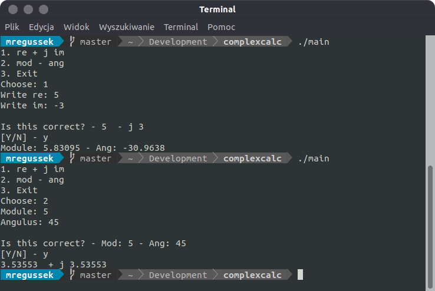

# My Helper for Complex Numbers Calculator
The idea was to create fast app to calculate between some of the forms
of the voltage and current in Electric Circuits.

## Installation

Use the [g++](https://www.geeksforgeeks.org/compiling-with-g-plus-plus/) to install Complex Calculator or another compiler you like.

```bash
g++ -o main main.cpp complex.cpp complex.h -lstdc++
```

## Usage

```bash
./main
```
## License

[MIT](https://choosealicense.com/licenses/mit/)

## Author

Mateusz Rzeczyca

mateuszrzeczyca17@gmail.com

## Screenshots


